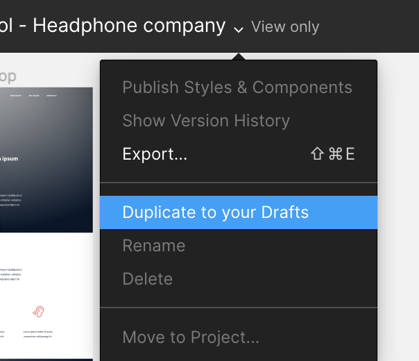

# CSS Advanced Project

This project focuses on the CSS and styling of a webpage based on the provided design in the Figma file. It is an extension of the previous HTML, advanced project and requires the completion of all tasks from that project.

## Table of Contents
- [Introduction](#introduction)
- [Requirements](#requirements)
- [Tasks](#tasks)
- [Resources](#resources)
- [Getting Started](#getting-started)
- [Contributing](#contributing)
- [License](#license)

## Introduction
This project aims to enhance your understanding and skills in CSS and web design. It provides an opportunity to apply the knowledge acquired from the HTML, advanced project and focus on styling the different sections of a webpage.

## Requirements
- All files should end with a new line.
- The project must have a README.md file at the root of the folder.
- External libraries are not allowed. The project should be built with only HTML, CSS, and JavaScript.
- The code should be W3C compliant and pass validation using the W3C Validator.

## Tasks
1. Import the style: Create the `styles.css` file and import it in the `index.html` file.
2. Header and Banner: Apply the correct styling to the header and first section of the page based on the design in the Figma file.
3. Quotes: Add the appropriate styling to the quote section according to the design in the Figma file.
4. Videos list: Style the videos list section based on the design in the Figma file.
5. Membership: Apply the correct styling to the membership section as shown in the Figma file.
6. FAQ: Style the FAQ section according to the design provided in the Figma file.
7. Footer: Add the necessary styling to the footer section based on the design in the Figma file.

## Learning Objectives
At the end of this project, you are expected to be able to explain to anyone, without the help of Google:

General
What is CSS
How to add style to an element
What is a class
What is a selector
How to compute CSS Specificity Value
What are Box properties in CSS
How does the browser load a webpage

## Requirements
General
All your files should end with a new line
A README.md file, at the root of the folder of the project is mandatory
You are not allowed to install, import or use external libraries. This website must be build with only HTML/CSS/JavaScript. No NodeJS, React, VueJS, Bootstrap, etc.
Your code should be W3C compliant and validate with W3C-Validator
## Resources
- [Figma Design File](link-to-figma-design-file)
- [HTML, advanced project](link-to-html-advanced-project)
- [Learn to Code HTML & CSS](link-to-learn-html-css)
- [CSS MDN](link-to-css-mdn)

## Getting Started
1. Clone the repository: `git clone <repository-url>`
2. Open the project in your preferred code editor.
3. Follow the instructions in the tasks to complete the CSS styling based on the Figma design.
4. Use the provided resources and additional research to enhance your understanding of CSS and web design.

